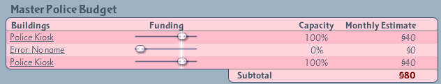
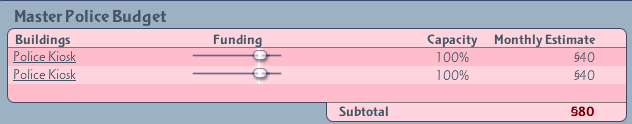

# sc4-remove-phantom-budget-items

A DLL Plugin for SimCity 4 that removes phantom items from the budget department lists.   
This DLL only removes the phantom budget entries, it does not remove the buildings, lots, or other in-game
effects such as the Landmark or Park effects.

Before:

After:

The plugin can be downloaded from the Releases tab: https://github.com/0xC0000054/sc4-remove-phantom-budget-items/releases

## System Requirements

* Windows 10 or later

The plugin may work on Windows 7 or later with the [Microsoft Visual C++ 2022 x86 Redistribute](https://aka.ms/vs/17/release/vc_redist.x86.exe) installed, but I do not have the ability to test that.

## Installation

1. Close SimCity 4.
2. Copy `SC4RemovePhantomBudgetItems.dll` into the Plugins folder in the SimCity 4 installation directory.
3. Start SimCity 4.

## Using the Plugin

The plugin adds a `RemovePhantomBudgetItems` cheat code with the following syntax:

`RemovePhantomBudgetItems <category> [all]`

The `<category>` parameter is one of: Fire, Police, Jail, Power, Education or Health.    
The `[all]` parameter is optional, it makes the plugin to clear the specified budget category instead of
only entries associated with plugin(s) that no longer exist.
The `[all]` parameter is intended to be used if phantom budget items remain in the budget menu after
demolishing all existing buildings in the specified category.

All commands are case-insensitive.

## Troubleshooting

The plugin should write a `SC4RemovePhantomBudgetItems.log` file in the same folder as the plugin.    
The log contains status information for the most recent run of the plugin.

# License

This project is licensed under the terms of the MIT License.    
See [LICENSE.txt](LICENSE.txt) for more information.

## 3rd party code

[gzcom-dll](https://github.com/nsgomez/gzcom-dll/tree/master) Located in the vendor folder, MIT License.    
[EABase](https://github.com/electronicarts/EABase) Located in the vendor folder, BSD 3-Clause License.    
[EASTL](https://github.com/electronicarts/EASTL) Located in the vendor folder, BSD 3-Clause License.    
[Windows Implementation Library](https://github.com/microsoft/wil) - MIT License    
[SC4Fix](https://github.com/nsgomez/sc4fix) - MIT License    
[Boost.Algorithm](https://www.boost.org/doc/libs/1_84_0/libs/algorithm/doc/html/index.html) - Boost Software License, Version 1.0.    

# Source Code

## Prerequisites

* Visual Studio 2022
* [VCPkg](https://github.com/microsoft/vcpkg) with the Visual Studio integration

## Building the plugin

* Open the solution in the `src` folder
* Update the post build events to copy the build output to you SimCity 4 application plugins folder.
* Build the solution

## Debugging the plugin

Visual Studio can be configured to launch SimCity 4 on the Debugging page of the project properties.
I configured the debugger to launch the game in a window with the following command line:    
`-intro:off -CPUcount:1 -w -CustomResolution:enabled -r1920x1080x32`

You may need to adjust the window resolution for your primary screen.
